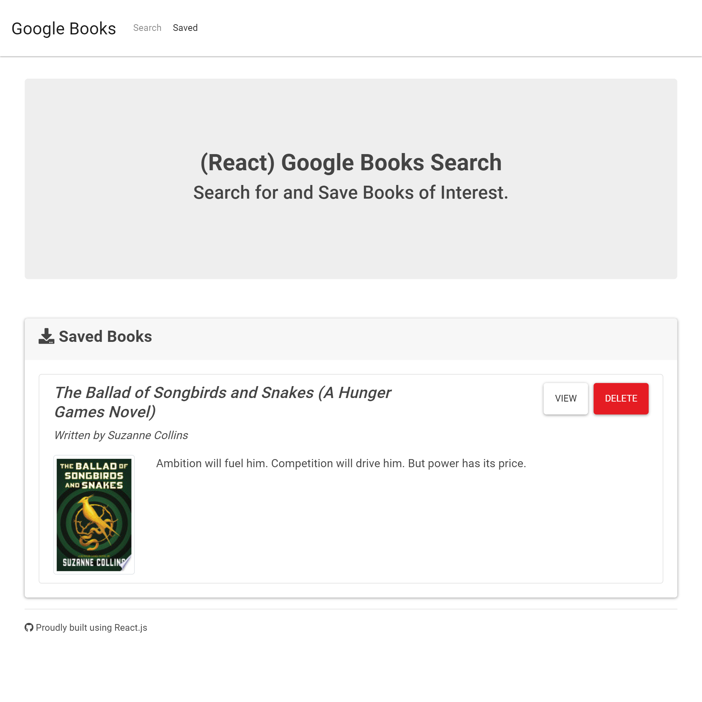

# Google Books Search 
   
## Table of Contents
* [Installation](#Installation)
* [Usage](#Usage)
* [Credits](#Credits)
* [Contributing](#Contributing)
* [License](#License)
## Description
```
As a reader,
I want a google book searcher
So that I can save  what books I want to read next.
```

[](https://google-book-search-dvasquez415.herokuapp.com/)

## Installation
```npm i```
## Usage
```npm start```
## Credits
[ Daniel Vasquez Talavera](https://github.com/DVasquez4155)
## Contributing
This project has adopted the code of conduct defined by [Contributor Covenant](https://www.contributor-covenant.org/version/2/0/code_of_conduct/).
## License
Licensed under the [MIT License](https://choosealicense.com/licenses/mit/) license.
